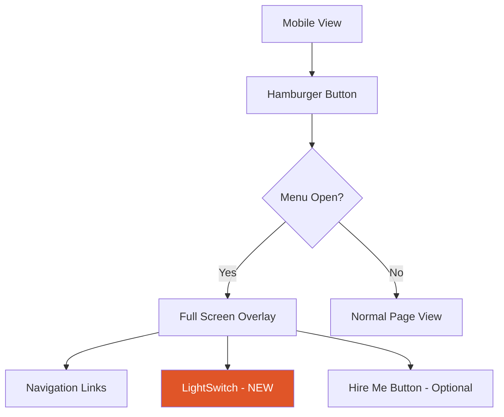

# Image Optimization & Mobile Responsiveness Plan

## Problem Summary

1. **Images appear blurry/low quality** on both PC and mobile devices
2. **LightSwitch button vanishes on mobile** - it's only visible in desktop navigation
3. **Need crisp, clear output** across all device sizes

---

## Root Cause Analysis

### Issue 1: Image Quality Problems

**Current State:**
- [`next.config.mjs`](next.config.mjs) only defines `formats: ["image/avif", "image/webp"]`
- Missing critical optimization settings:
  - No `deviceSizes` for responsive breakpoints
  - No `imageSizes` for specific image widths
  - No default `quality` setting

**Files Affected:**
- [`src/components/sections/Hero.tsx`](src/components/sections/Hero.tsx:79) - Photo card image
- [`src/components/sections/About.tsx`](src/components/sections/About.tsx:26) - ID card image
- [`src/app/projects/[slug]/page.tsx`](src/app/projects/[slug]/page.tsx) - Project detail images

### Issue 2: LightSwitch Vanishing on Mobile

**Current State:**
- [`src/components/layout/Navbar.tsx`](src/components/layout/Navbar.tsx:44) - LightSwitch is inside `hidden md:flex` container
- Mobile menu overlay at lines [80-110] does NOT include LightSwitch
- Users on mobile have NO way to toggle dark/light mode

```tsx
// Line 44 - Desktop only nav
<nav className="hidden md:flex items-center gap-10" aria-label="Main navigation">
  {/* ... */}
  <LightSwitch />  // <-- Only visible on md breakpoint and up
</nav>
```

---

## Solution Plan

### Phase 1: Next.js Image Configuration

**File:** [`next.config.mjs`](next.config.mjs)

Add comprehensive image optimization settings:

```javascript
const nextConfig = {
  images: {
    formats: ["image/avif", "image/webp"],
    deviceSizes: [640, 750, 828, 1080, 1200, 1920, 2048, 3840],
    imageSizes: [16, 32, 48, 64, 96, 128, 256, 384],
    minimumCacheTTL: 60,
    remotePatterns: [
      { protocol: "https", hostname: "**" },
    ],
  },
  // ... rest of config
};
```

**Benefits:**
- `deviceSizes` - Defines responsive breakpoints for srcSet generation
- `imageSizes` - Small image sizes for icons, thumbnails
- `minimumCacheTTL` - Better caching for performance
- `remotePatterns` - Allow external images if needed

### Phase 2: LightSwitch Mobile Integration

**File:** [`src/components/layout/Navbar.tsx`](src/components/layout/Navbar.tsx)

Add LightSwitch to mobile menu overlay:

```tsx
// Inside the mobile menu AnimatePresence block
<motion.div className="fixed inset-0 bg-bg z-[190] flex flex-col items-center justify-center">
  <ul className="list-none text-center space-y-6">
    {NAV_LINKS.map((label, i) => (/* ... */))}
  </ul>
  
  {/* ADD: LightSwitch for mobile */}
  <div className="mt-8">
    <LightSwitch />
  </div>
</motion.div>
```

### Phase 3: Image Component Optimization

**File:** [`src/components/sections/Hero.tsx`](src/components/sections/Hero.tsx:79)

Update Image component with quality and better sizes:

```tsx
<Image
  src="/photo.jpg"
  alt="Michael Oguntimehin"
  fill
  quality={90}
  className="object-cover"
  style={{ objectPosition: "center 15%" }}
  sizes="(max-width: 1024px) 0px, 380px"
  priority
/>
```

**File:** [`src/components/sections/About.tsx`](src/components/sections/About.tsx:26)

```tsx
<Image
  src="/photo.jpg"
  alt="Michael Oguntimehin"
  fill
  quality={90}
  className="object-cover transition-transform duration-700 hover:scale-[1.03]"
  style={{ objectPosition: "center 8%" }}
  sizes="(max-width: 768px) 100vw, 380px"
  priority={false}
/>
```

### Phase 4: Project Detail Page Images

**File:** [`src/app/projects/[slug]/page.tsx`](src/app/projects/[slug]/page.tsx)

Review and update all Image components with:
- `quality={90}` for crisp output
- Proper `sizes` attribute based on layout
- `priority` for above-fold images

---

## Implementation Checklist

- [ ] **next.config.mjs** - Add deviceSizes, imageSizes, minimumCacheTTL
- [ ] **Navbar.tsx** - Add LightSwitch to mobile menu overlay
- [ ] **Hero.tsx** - Update Image with quality and optimized sizes
- [ ] **About.tsx** - Update Image with quality and optimized sizes
- [ ] **projects/[slug]/page.tsx** - Audit and update all Image components
- [ ] Test on mobile viewport - Verify LightSwitch visibility
- [ ] Test image quality on various devices

---

## Mobile Responsiveness Considerations

### LightSwitch Positioning on Mobile

The LightSwitch should be:
1. Visible in the mobile menu overlay
2. Easily tappable - minimum 44x44px touch target
3. Clearly labeled for accessibility

### Current LightSwitch Dimensions
- Width: 28px
- Height: 44px

This meets minimum touch target requirements, but consider adding padding for easier tapping.

---

## Diagram: Mobile Menu Structure



---

### Phase 5: Dark Mode "Builder" Text Visibility Fix

**File:** [`src/components/sections/Hero.tsx`](src/components/sections/Hero.tsx:48)

**Problem:** The "Builder" text uses `text-transparent` with `WebkitTextStroke: "1.5px #111010"`. The stroke color `#111010` is nearly black, making it invisible against dark backgrounds in dark mode.

**Current Code:**
```tsx
style={{
  fontSize: "clamp(3.5rem, 10.5vw, 11rem)",
  WebkitTextStroke: i === 2 ? "1.5px #111010" : undefined,
}}
```

**Solution:** Use CSS variable or conditional stroke color based on theme:

```tsx
style={{
  fontSize: "clamp(3.5rem, 10.5vw, 11rem)",
  WebkitTextStroke: i === 2 ? "1.5px var(--ink)" : undefined,
}}
```

This uses the `--ink` CSS variable which automatically switches between:
- Light mode: `#111010` (dark)
- Dark mode: `#f0ece6` (light)

---

## Expected Outcomes

1. **Crisp Images** - Proper srcSet generation with AVIF/WebP formats
2. **Mobile LightSwitch** - Theme toggle accessible on all devices
3. **Better Performance** - Optimized image loading with correct sizes
4. **Consistent Experience** - Same visual quality across breakpoints
5. **Visible "Builder" Text** - Outlined text visible in both light and dark modes
